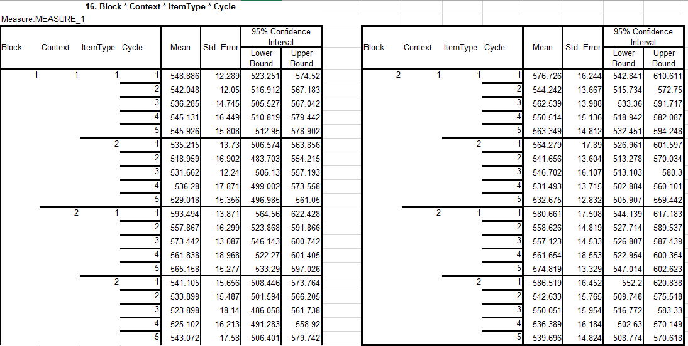

The purpose of this notebook is to replicate the descriptive and inferential statistics reported in the original thesis. I'll be importing preprocessed data, and the notebook detailing the preprocessing procedures can be found [here](http://htmlpreview.github.io/?https://github.com/dab414/semantic_interference/blob/master/experiment_1/notebooks/exp1_preprocessing.nb.html). 

The design is a 2 (block: labeled vs unlabeled) X 5 (cycle) X 2 (item type: RAT vs category) X 2 (context: homogeneous vs heterogeneous) within-subjects ANOVAs on RTs. RTs here are simply how long it takes the subject to pronounce each presented stimulus.

## Reproducing the cell means

Loading libraries and data.

```{r}
library(tidyverse)
library(data.table)
library(ez)
```

Load data.

```{r}
current_data <- fread('../data/exp1_clean.csv')
head(current_data)
str(current_data)
```

We'll use these woefully difficult-to-decipher cell means generated by SPSS as reference:

  


Just realizing this is extra compounded bc she used ambiguous factor labels in SPSS...


Let's see how we do.

```{r}
N <- current_data %>% 
  group_by(subject) %>% 
  summarize(n()) %>% 
  nrow()

current_data %>% 
  group_by(subject, context, block, cycle, item_type) %>% 
  summarize(rt = mean(rt)) %>% 
  group_by(block, context, item_type, cycle) %>%
  summarize(r_time = mean(rt), se = sd(rt) / sqrt(N))
```

But after spot checking the first and last few values, things look like they're actually matching up perfectly.


### Reproducing the ANOVA

```{r}
current_data <-current_data %>% 
  mutate(cycle = as.factor(cycle))

m1 <- ezANOVA(data = current_data, wid = subject, within = .(block, context, item_type, cycle), dv = rt, detailed = TRUE, type = 3)
m1
```


